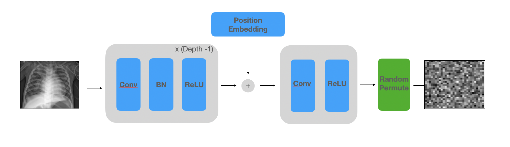

# NeuraCrypt

Implementation of [NeuraCrypt](https://arxiv.org/abs/2106.02484), a private encoding scheme based on random deep neural networks. NeuraCrypt encodes raw patient data using a randomly constructed neural network known only to the data-owner, and publishes both the encoded data and associated labels publicly.  From a theoretical perspective, we demonstrate that sampling from a sufficiently rich family of encoding functions offers a well-defined and meaningful notion of privacy against a computationally unboundedadversary with full knowledge of the underlying data-distribution.  We propose to approximate this family of encoding functions through random deep neural networks. Empirically, we demonstrate the robustness of our encoding to a suite of adversarial attacks and show that NeuraCrypt achieves competitive accuracy to non-private baselines on a variety of x-ray tasks.  Moreover, we demonstrate that multiple hospitals, using independent private encoders, can collaborate to train improved x-ray models. Finally, we release a [challenge dataset](https://www.github.com/yala/NeuraCrypt-Challenge) to encourage the development of new attacks on NeuraCrypt.


Please contact @yala (adamyala@mit.edu) with any questions or post an issue on this github.  

#### NeuraCrypt Architecture

While many NeuraCrypt architectures are possible, we focus on medical imaging tasks, and thus implement our NeuraCrypt encoders as convolutional neural networks. Our encoder architecture is illustrated in the figure above, and consists of convolutional layers with non-overlapping strides, batch normalization, and ReLU non-linearities. To encode positional information into the feature space while hiding spatial structure, we add a random positional embedding for each patch before the final convolutional and ReLU layers and randomly permute the patches at the output independently for each private sample. This results in an unordered set of patch feature vectors for each image. We note that this architecture is closely inspired by the design of patch-embedding modules in Vision Transformer networks.


## Installing Dependencies
- Install [Conda](https://www.anaconda.com/blog/moving-conda-environments)
- Build the environment:
```
    conda env create -f environment.yml
```

## Download datasets
- Get the [MIMIC-CXR](https://physionet.org/content/mimic-cxr/2.0.0/) dataset
- Get the [CheXpert](https://stanfordmlgroup.github.io/competitions/chexpert/) dataset

Our splits and processed labels for each dataset (as well as the combined datasets) are in json files in the `data` folder.
Note, our `json` files rely on absolute paths and so you'll need to update this to reflect where your images are stored.

## Running NeuraCrypt models
To train a NeuraCrypt for a single dataset, such as `mimic_cxr_edema`, you can use the following command:
```
python scripts/main.py --batch_size 64 --dataset mimic_cxr_edema  --train --dev --test --model_name reference_transformer --gpus 1 --rlc_cxr_test --num_layers 1 --num_heads 8 --class_bal --max_epochs 25 --private
```
To run a grid search over all datasets and training settings, run:
```
python scripts/dispatcher.py --experiment_config_path configs/cxr/neuracrypt.json
```

We note that the slowest step in this code is the patch shuffling at the end of our the encoder. Since ViTs (and transformers in general) are invariant to shuffling, you can remove the shuffling for a speed-up with the `--remove_pixel_shuffle` flag. 

## Running ViT baselines
To train our ViT baseline for a single dataset, you remove the `--private` flag from the above command. In otherwords, run the following:
```
python scripts/main.py --batch_size 64 --dataset mimic_cxr_edema  --train --dev --test --model_name reference_transformer --gpus 1 --rlc_cxr_test --num_layers 1 --num_heads 8 --class_bal --max_epochs 25
```
To run a grid search over all datasets and training settings, run:
```
python scripts/dispatcher.py --experiment_config_path configs/cxr/baseline_vit.json
```


## Running adversarial attacks
To run an MMD-based adversarial attack, use the following command:
```  python scripts/main.py --batch_size 64 --dataset combined_cxr_cardiomegaly  --test --model_name reference_transformer --gpus 1 --rlc_cxr_test --private --train --num_layers 1 --num_heads 8 --class_bal --use_adv --use_same_dist --use_mmd_adv --max_epochs 25```
Use can run a grid search over attacks with:
```
python scripts/dispatcher.py --experiment_config_path configs/cxr/adversarial_attack.json.json
```
or
```
python scripts/dispatcher.py --experiment_config_path configs/cxr/adversarial_attack_across_depth.json
```
We note that using a `private_depth = -1` leverages a linear encoding.

## Running transfer learning attacks
To run a transfer learning attack, first run an MMD-based attack add the flag `--results_path attack.results`. Given this result, 
you can now use the following command for a transfer learning attack:
```python scripts/main.py --batch_size 64 --dataset combined_cxr_edema --attack_snapshot attack.results  --train --dev --test --private_switch_encoder --model_name reference_transformer --gpus 1 --num_layers 1 --num_heads 8 --class_bal --max_epochs 25```

To run a grid search over transfer learning attacks, you can use:
```
python scripts/dispatcher.py --experiment_config_path configs/cxr/adversarial_transfer.json.json
```
```
python scripts/dispatcher.py --experiment_config_path configs/cxr/adversarial_transfer_linear.json
```

## Citing NeuraCrypt
```
@misc{yala2021neuracrypt,
      title={NeuraCrypt: Hiding Private Health Data via Random Neural Networks for Public Training}, 
      author={Adam Yala and Homa Esfahanizadeh and Rafael G. L. D' Oliveira and Ken R. Duffy and Manya Ghobadi and Tommi S. Jaakkola and Vinod Vaikuntanathan and Regina Barzilay and Muriel Medard},
      year={2021},
      eprint={2106.02484},
      archivePrefix={arXiv},
      primaryClass={cs.CR}
}
```

## Acknowledgements
We would like to thank @lucidrains, who's [vit library](https://github.com/lucidrains/vit-pytorch) was the basis of the ViT implementation used in our experiments.

